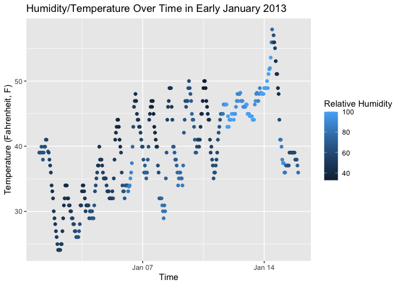

P8105_HW1_jao2195
================

# Problem 1.1 - Install Packages / Load Libraries

This problem focuses the use of inline R code, plotting, and the
behavior of ggplot for variables of different types.

Use the code below to download the a package containing the
early_january_weather dataset:

install.packages(“moderndive”).

You only need to run this command once to install the package, and you
can do so directly in the console. This code shouldn’t be executed by
your RMarkdown file.

Load the moderndive library, and use the following code to load the
early_january_weather dataset:

``` r
#1. Installing Packages and Libraries 

#
#Loading Libraries
library(moderndive)
library(tidyverse)
library(ggplot2)

#2. Loading early_january_weather dataset from moderndive package.

data(early_january_weather)

#3. Looking at help function to learn more about the variables in the dataset. 
help(early_january_weather)
```

# Problem 1.2 - Inline R code Dataset Discussion Short Description

Write a short description of the dataset using inline R code accessing
the dataset help file can be informative. In your discussion, please
include:

*the variables in this dataset, including names / values of important
variables *the size of the dataset (using nrow and ncol) \*the mean
temperature

################################################################################ 

# My Short Description of Early January Weather Dataset

The Early January Weather data (early_january_weather) is a dataset that
contains hourly meterological data for Laguardia (LGA), John F. Kennedy
(JFK) N, and Newark (EWR) Airports in the New York City area. This data
is a subset of the nycflights13 dataset in R. This dataset contains 15
variables: origin, year, month, day, hour, temp, dewp, humid, wind_dir,
wind_speed, wind_gust, precip, pressure, visib, time_hour and 358
observations. Values of importat variables in the dataset include:
Average Preciptation, which was 0.0020391 inches. Maximum visibility in
early January was 10 miles. The mean (average) temperature in early
January 2013 was 40 degrees Fahrenheit !

################################################################################ 

# Problem 1.3 - Creating Scatterplot of Humidity/Temperature Over Time

Make a scatterplot of temp (y) vs time_hour (x); color points using the
humid variable (adding color = … inside of aes in your ggplot code
should help). Describe patterns that are apparent in this plot. Export
your scatterplot to your project directory using ggsave.

################################################################################ 

# My Short Description of the Scatterplot

``` r
#Creating Scatterplot, storing in myplot object.
myplot <-
  ggplot(early_january_weather) + 
  geom_point(aes(x= time_hour, y = temp, col= humid)) + 
  labs(x="Time", y="Temperature (Fahrenheit, F)", col="Relative Humidity", title="Temperature vs. Humidity ") 

#Printing myplot object to rendered document.
myplot
```

<!-- -->

``` r
#Saving .png file version to plot to working directory (wd).
ggsave("Temp_Humid_Scatterplot_Problem 1.png") 
```

    ## Saving 7 x 5 in image
